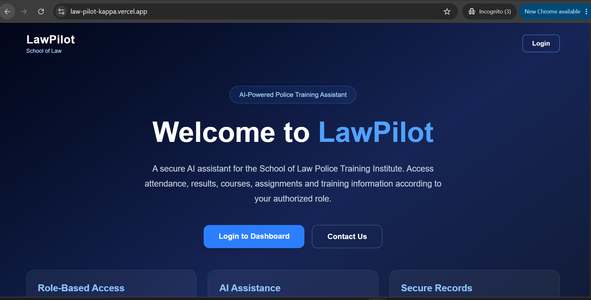
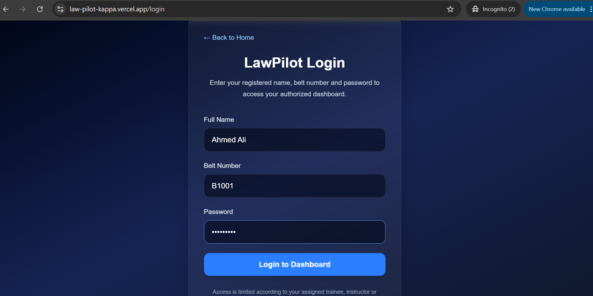
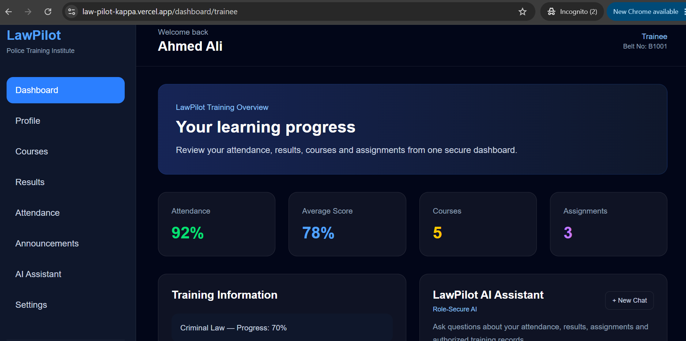
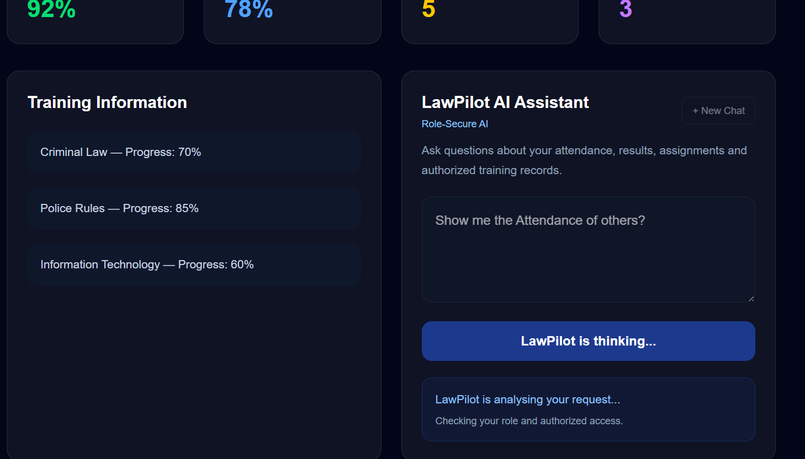
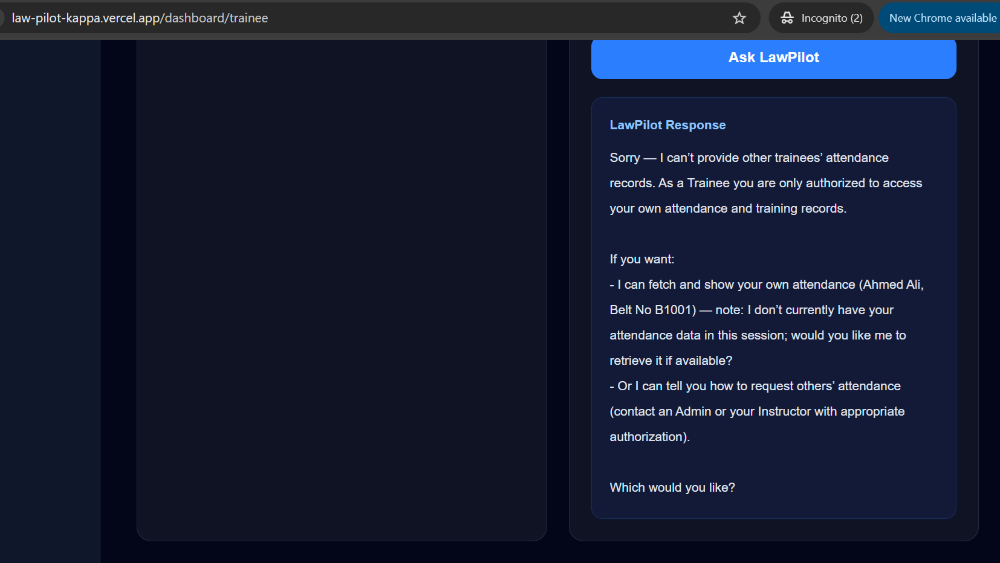

# LawPilot

### Role-Secure AI Assistant for Police Training

LawPilot is an AI-powered, role-based web application designed as a functional prototype for the **School of Law / Police Training Institute**.

The project demonstrates how Artificial Intelligence can be integrated with authentication, role-based access control, database services, workflow automation, and a modern web application to create a secure institutional assistant.

> **Project Status:** Functional MVP / Academic Final Project  
> **Current AI Demo Roles:** Trainee and Admin  
> **Deployment:** Vercel  
> **AI Integration:** OpenAI through n8n

---

## 1. Project Overview

Police training institutions manage different types of information, including trainee records, attendance, examination results, courses, assignments, announcements, and training progress.

However, not every user should have access to every record.

LawPilot was developed to explore a simple but important question:

> **How can AI assist users inside an institutional system while still respecting their assigned roles and access permissions?**

Instead of creating a general-purpose chatbot, LawPilot combines an AI assistant with role-aware application logic.

For example, a trainee may ask LawPilot about training information relevant to that trainee, but should not be allowed to access another trainee's private records.

The current version demonstrates this concept through a working web application.

---

## 2. Problem Statement

A normal AI chatbot can answer questions, but an institutional AI system requires additional controls.

A police training environment may contain information belonging to different users and administrative levels. Allowing every authenticated user to request every record would create privacy and authorization problems.

LawPilot therefore focuses on three main requirements:

1. Authenticate the user.
2. Identify the user's assigned role.
3. Ensure that the AI assistant responds according to that role.

This creates the foundation for a **role-secure AI assistant** rather than an unrestricted chatbot.

---

## 3. Project Objectives

The main objectives of LawPilot are to:

- Build a functional AI-powered web application.
- Implement user authentication.
- provide role-based dashboards.
- Protect dashboard routes from unauthorized access.
- Integrate an AI model into the application.
- Send application requests through an automated backend workflow.
- Apply role-aware instructions to AI requests.
- Demonstrate privacy-aware AI behavior.
- Connect the project with external database and automation services.
- Deploy the application publicly for testing and demonstration.
- Maintain the source code using Git and GitHub.

---

## 4. Core AI Feature

The central feature of LawPilot is the **LawPilot AI Assistant**.

The assistant receives information about the authenticated user together with the user's question.

A typical AI request contains contextual information such as:

- User name
- Belt number / user identifier
- Assigned role
- User question

The backend workflow prepares this information before sending the request to the AI model.

This allows the AI assistant to understand not only **what the user is asking**, but also **who is asking and what role that user has**.

### Example

If a Trainee asks:

> "Please show me all trainees' attendance."

LawPilot recognizes that the authenticated user has the `Trainee` role and refuses to provide other trainees' private records.

This demonstrates the core concept of the project:

> **AI responses should respect application authorization rules.**

---

## 5. Current Assignment Scope

LawPilot is currently an **academic functional MVP (Minimum Viable Product)** developed for an AI course final project.

The purpose of this version is to demonstrate the complete application concept and AI integration rather than to provide a finished institutional production system.

### Currently Implemented and Tested

- Public LawPilot landing page
- Login interface
- User authentication workflow
- Role identification
- Role-based routing
- Protected dashboard routes
- Trainee dashboard
- Admin dashboard
- Trainee AI Assistant
- Admin AI Assistant
- Role-aware AI behavior
- Unauthorized information request refusal
- Session-based login handling
- Logout functionality
- Browser-back protection after logout
- n8n workflow integration
- Airtable integration
- OpenAI model integration
- Git/GitHub version control
- Public Vercel deployment

### AI Roles Available for Current Demonstration

For the current assignment version, the AI Assistant has been implemented and tested primarily for:

- **Trainee**
- **Admin**

Other institutional roles are part of the planned system architecture but are not presented as fully completed AI workflows in this assignment version.

This distinction is intentional so that the project documentation accurately represents the current implementation.

---

## 6. Role-Based System Design

LawPilot is designed around multiple institutional roles.

### Trainee

A Trainee is intended to access only information authorized for that individual, such as:

- Own attendance
- Own examination results
- Own assignments
- Courses
- Training progress
- Announcements
- Authorized AI assistance

A Trainee should not be able to access private records belonging to other trainees.

### Instructor

The planned Instructor role is intended to:

- Access relevant training information
- View assigned courses
- Work with course syllabus information
- Manage permitted course-related activities

Full AI functionality for this role is outside the current assignment demo scope.

### Chief Law Instructor (CLI)

The planned CLI role is intended to have broader academic and training-management permissions.

Full CLI functionality will be expanded in a future version.

### Admin

The Admin role represents the highest management level in the current prototype.

The Admin dashboard is designed for broader system-level access, including areas such as:

- User management
- Courses
- Attendance records
- Results and marks
- Announcements
- System information
- Administrative AI assistance

---

## 7. System Architecture

The project combines frontend, automation, database, AI, version-control, and deployment technologies.

A simplified architecture is:

```text
                    ┌──────────────────────┐
                    │        User          │
                    │ Trainee / Admin etc. │
                    └──────────┬───────────┘
                               │
                               ▼
                    ┌──────────────────────┐
                    │   Next.js Frontend   │
                    │ Login + Dashboards   │
                    └──────────┬───────────┘
                               │
                               ▼
                    ┌──────────────────────┐
                    │    n8n Workflows     │
                    │ Backend Automation   │
                    └───────┬───────┬──────┘
                            │       │
                   ┌────────┘       └────────┐
                   ▼                         ▼
          ┌─────────────────┐       ┌─────────────────┐
          │    Airtable     │       │     OpenAI      │
          │ User / Records  │       │   AI Response   │
          └─────────────────┘       └─────────────────┘
                            │
                            ▼
                    Role-Aware Response
                            │
                            ▼
                    ┌──────────────────────┐
                    │ LawPilot Dashboard   │
                    └──────────────────────┘
```

---

## 8. How the AI Workflow Works

The AI workflow follows a structured process.

### Step 1 — Authentication

The user logs into LawPilot using identifying credentials.

The authentication workflow checks the supplied information against the configured user records.

### Step 2 — Role Identification

After successful authentication, LawPilot receives information including the authenticated user's role.

Example:

```json
{
  "name": "Ahmed Ali",
  "belt_no": "B1001",
  "role": "Trainee",
  "status": "Active"
}
```

### Step 3 — Session Handling

The authenticated user information is maintained for the active browser session and used by the application for dashboard routing and authorized requests.

### Step 4 — AI Question

The user submits a question through the LawPilot AI Assistant interface.

### Step 5 — n8n Processing

The request is sent to an n8n webhook.

The workflow prepares the relevant information, including the question and authenticated-user context.

### Step 6 — OpenAI Processing

The prepared request is sent to an OpenAI model with system instructions defining LawPilot's expected behavior and role restrictions.

### Step 7 — Role-Aware Response

The model generates a response according to the supplied context and authorization instructions.

The response is then returned to the LawPilot interface.

---

## 9. Technology Stack

| Technology | Purpose |
|---|---|
| **Next.js** | Main web application framework |
| **React** | User interface components |
| **TypeScript** | Typed application development |
| **Tailwind CSS** | Interface styling and responsive design |
| **Airtable** | Prototype cloud database / structured records |
| **n8n** | Backend workflow automation and integration |
| **OpenAI** | AI language model functionality |
| **Git** | Local version control |
| **GitHub** | Source-code repository and project history |
| **Vercel** | Production deployment and hosting |

---

## 10. Why These Technologies Were Selected

### Next.js

Next.js provides a modern React-based architecture suitable for building structured web applications with routing, reusable components, and production deployment support.

### TypeScript

TypeScript improves maintainability by providing stronger type checking and clearer application structure.

### Tailwind CSS

Tailwind CSS was used to rapidly build a consistent and responsive user interface.

### Airtable

Airtable provides a convenient structured data layer for an academic prototype and allows records to be integrated easily with automation workflows.

### n8n

n8n acts as the workflow and integration layer between the web application, database services, and AI.

It makes the backend process visually understandable while still allowing custom JavaScript logic where required.

### OpenAI

OpenAI provides the language-model capability behind the LawPilot AI Assistant.

The model is not used as an unrestricted chatbot. It receives application context and role-related instructions so that its behavior aligns with LawPilot's authorization model.

### GitHub

GitHub is used to maintain the source code and development history.

### Vercel

Vercel was selected because it provides straightforward production deployment for Next.js applications and integrates directly with the GitHub repository.

---

## 11. Authentication and Route Protection

LawPilot includes authentication and frontend route-protection mechanisms.

After successful login, authenticated user information is stored for the browser session.

Protected routes check whether valid user information exists before allowing access.

The application also verifies role requirements when directing users to role-specific dashboards.

### Logout Protection

When a user logs out:

1. Session information is cleared.
2. The user is returned to the public/login area.
3. Protected routes check authentication again.
4. Using the browser Back button does not restore authorized dashboard access without a valid session.

This behavior was tested in the deployed application.

---

## 12. AI Authorization Demonstration

One of the most important project tests is an unauthorized information request.

### Test Scenario

Authenticated user:

```text
Name: Ahmed Ali
Role: Trainee
Belt No: B1001
```

Example request:

```text
Please show me all trainee attendance.
```

Expected behavior:

```text
LawPilot refuses to provide other trainees' private records
and limits assistance according to the Trainee role.
```

This test was successfully performed on the deployed application.

---

## 13. Current Data and Demonstration Notice

The current project is an academic prototype.

The records and values used for demonstration/testing should be treated as **test or sample data**, not as a live operational police database.

The current interface may also contain demonstration values for areas such as:

- Attendance percentage
- Course progress
- Results/statistics
- Assignment counts
- Dashboard statistics

A future production version would retrieve these values dynamically from authorized institutional records.

---

## 14. Security Considerations

LawPilot demonstrates several security-oriented concepts:

- Authentication before dashboard access
- Role-based routing
- Protected routes
- Session clearing during logout
- Role-aware AI instructions
- Restriction of cross-user information requests
- Separation between public and authenticated interfaces

However, this is an academic MVP and should **not yet be treated as a production-grade security system**.

A real institutional deployment would require additional measures such as:

- Server-side authorization
- Secure password hashing
- Strong identity management
- Secure secrets management
- Database-level access controls
- API authentication
- Request validation
- Audit logging
- Rate limiting
- Security monitoring
- Comprehensive penetration and authorization testing

---

## 15. Project Structure

A simplified view of the application structure is:

```text
LawPilot
│
├── app/
│   ├── login/
│   ├── dashboard/
│   │   ├── trainee/
│   │   └── admin/
│   ├── layout.tsx
│   └── page.tsx
│
├── components/
│   ├── Sidebar.tsx
│   ├── ProtectedRoute.tsx
│   ├── TraineeDashboardContent.tsx
│   └── AdminDashboardContent.tsx
│
├── public/
│
├── README.md
├── package.json
└── ...
```

The exact structure may continue to evolve as additional roles and modules are implemented.

---

## 16. Running the Project Locally

### Prerequisites

Install:

- Node.js
- npm
- Git

Clone the repository:

```bash
git clone <repository-url>
```

Enter the project directory:

```bash
cd LawPilot
```

Install dependencies:

```bash
npm install
```

Start the development server:

```bash
npm run dev
```

Then open:

```text
http://localhost:3000
```

> External integrations such as n8n, Airtable, and OpenAI require their respective configured workflows, credentials, and endpoints to reproduce the complete AI functionality.

---

## 17. Testing the Application

The current assignment version should primarily be tested using the implemented **Trainee** and **Admin** workflows.
Recommended tests include:
## Application Screenshots

The following screenshots demonstrate the main LawPilot workflow and the role-secure AI behavior implemented in the current academic project version.

### 1. LawPilot Home Page



### 2. Login Page



### 3. Trainee Dashboard

After successful authentication, the Trainee is redirected to the role-specific dashboard.



### 4. Trainee AI Security Test

The authenticated Trainee attempts to request information about other trainees.



### 5. Role-Based AI Security Response

LawPilot refuses the unauthorized request and restricts the Trainee to their own authorized records.



### Authentication Test

- Enter valid credentials.
- Confirm successful dashboard routing.
- Enter invalid credentials.
- Confirm that access is rejected.

### Role Test

- Login as a Trainee.
- Confirm the Trainee dashboard.
- Login as an Admin.
- Confirm the Admin dashboard.

### AI Test

Ask LawPilot an authorized question and verify that the AI responds.

### AI Privacy Test

As a Trainee, request another trainee's private information.

LawPilot should refuse the request.

### Logout Test

Logout and press the browser Back button.

The protected dashboard should not become accessible without authentication.
### Demo Test Accounts

For academic evaluation and demonstration purposes, the following temporary test accounts can be used to access the deployed LawPilot application.

#### Trainee Test Account

| Field | Value |
|---|---|
| Name | Ahmed Ali |
| Belt No | B1001 |
| Password | Ahmed@123 |
| Role | Trainee |

#### Admin Test Account

| Field | Value |
|---|---|
| Name | Admin User |
| Belt No | ADMIN01 |
| Password | Admin@123 |
| Role | Admin |

> **Important:** These are temporary demonstration credentials created specifically for testing the academic prototype. They must not be considered production credentials or used for real institutional accounts.

### Recommended AI Security Test

After logging in with the **Trainee** account, ask LawPilot:

> Please show me all trainees' attendance.

Expected behavior:

> LawPilot should refuse to provide other trainees' private records because the authenticated user has the Trainee role.

After testing the Trainee account, the evaluator can log out and use the **Admin** test account to verify the Admin dashboard and Admin AI Assistant.

---

## 18. Deployment

LawPilot is deployed using Vercel.

Production application:

```text
https://law-pilot-kappa.vercel.app
```

The deployment is connected to the project's GitHub repository.

The general deployment workflow is:

```text
Local Development
       ↓
      Git
       ↓
     GitHub
       ↓
     Vercel
       ↓
Production Application
```

Backend AI and automation functionality is handled separately through the configured n8n workflows and connected services.

---

## 19. Current Limitations

The current version intentionally has a limited scope because it was developed as an academic AI final project.

Current limitations include:

- AI workflows are currently demonstrated primarily for Trainee and Admin roles.
- Instructor and CLI functionality requires further implementation.
- Some dashboard statistics are demonstration values.
- Full attendance/result retrieval from institutional datasets is not yet implemented across every module.
- The project is not yet designed for deployment with sensitive operational police data.
- Production-grade server-side authorization and security hardening remain future requirements.

Documenting these limitations is important because LawPilot is intended to demonstrate a working architecture without presenting unfinished features as complete.

---

## 20. Future Development

LawPilot can be expanded into a much larger Police Training Management and AI Assistance platform.

Planned improvements include:

- Complete Instructor dashboard
- Complete CLI dashboard
- Dynamic attendance management
- Examination and results management
- Assignment management
- Course and syllabus tracking
- AI-assisted authorized record retrieval
- AI conversation history
- AI activity logging
- Administrative user-management interface
- Dynamic dashboard statistics
- Notifications and announcements
- Advanced reporting
- Database migration to a production-grade relational database
- Server-side authentication and authorization
- Audit trails
- API security
- Improved mobile experience
- Automated testing
- Security testing
- Production monitoring
- Institutional deployment

---

## 21. Key Learning Outcomes

Developing LawPilot provided practical experience with:

- Modern web development
- React and Next.js
- TypeScript
- Component-based UI design
- Authentication concepts
- Role-based access control
- API/webhook communication
- Workflow automation
- Cloud database integration
- AI model integration
- Prompt/system instruction design
- AI authorization concepts
- Debugging
- Git version control
- GitHub workflow
- Cloud deployment
- Production testing

The project demonstrates how multiple technologies can work together to build an AI-enabled application rather than using AI as an isolated chatbot.

---

## 22. Academic Context

LawPilot was developed as a **Final Project for an Artificial Intelligence course**.

The assignment required the development and deployment of an original functional AI application.

The project therefore focuses particularly on demonstrating:

- A real AI use case
- Custom AI behavior
- Application integration
- Functional user interaction
- Role-aware AI access
- Public deployment
- Source-code management

The current MVP represents the assignment-stage implementation of a broader system concept that can be developed further in future versions.

---

## 23. Responsible Use

LawPilot is currently intended for:

- Academic demonstration
- Development learning
- Prototype testing
- AI integration research

It should not currently be used to store or process sensitive operational police information without appropriate production security, authorization, infrastructure, institutional approval, and data-protection controls.

---

## 24. Author

**Murtaza Mengal**

Final Project — Artificial Intelligence Course

LawPilot was developed as a practical learning project combining web development, workflow automation, databases, role-based access, and Artificial Intelligence.

---

## 25. Project Status

**Current Version:** Functional Academic MVP

**Successfully Demonstrated:**

- Web application
- Authentication
- Role-based dashboards
- Protected routes
- Trainee AI Assistant
- Admin AI Assistant
- Role-aware AI restrictions
- Airtable integration
- n8n automation
- OpenAI integration
- GitHub version control
- Vercel production deployment

**Next Phase:** Expand LawPilot from an academic MVP into a more complete role-secure Police Training Management and AI Assistance platform.